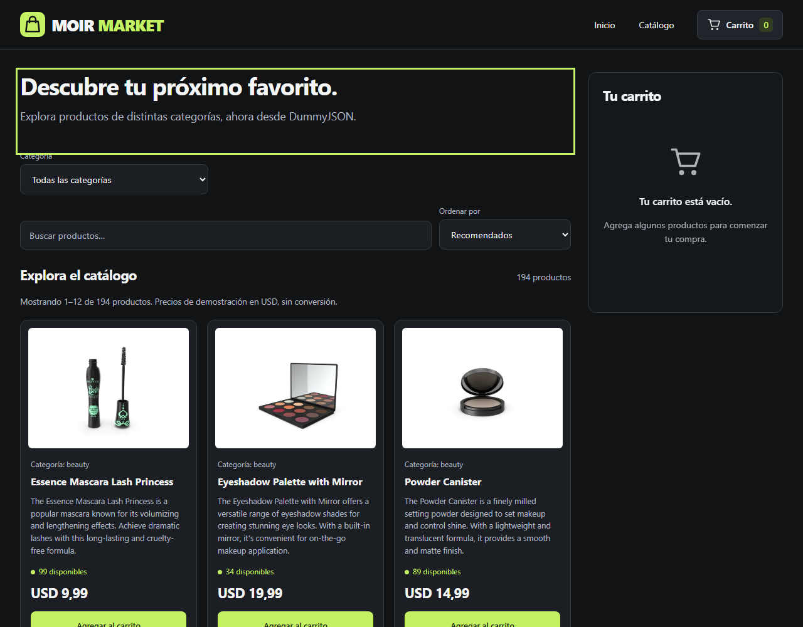
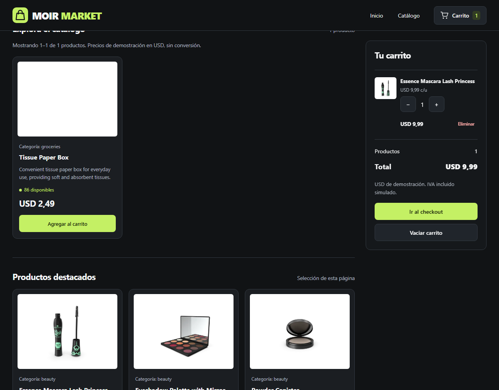
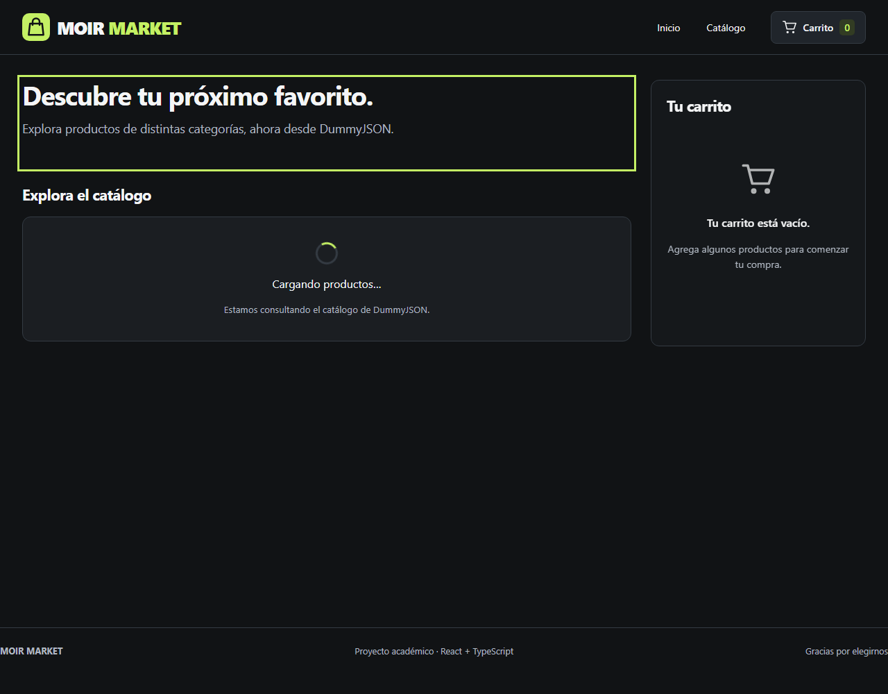
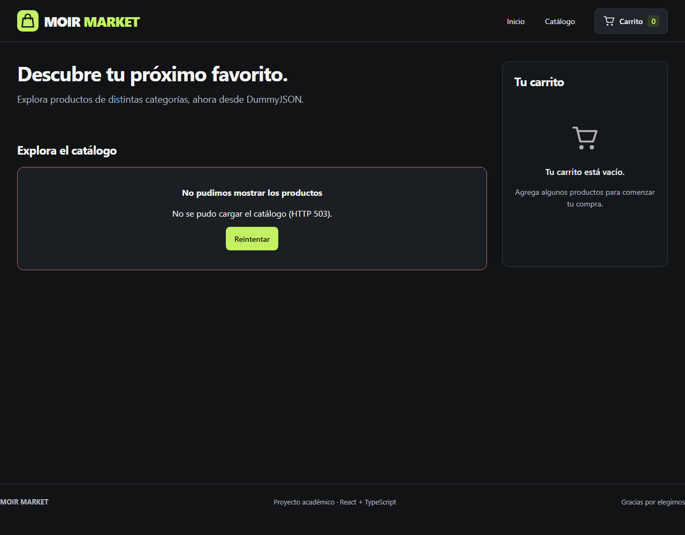

# Moir Market — E-commerce en React con consumo de API

Proyecto académico construido con React, TypeScript y Vite. Esta entrega obtiene los productos directamente de **DummyJSON**, permite buscar por nombre y muestra estados de carga y error.

Moir Market es una tienda de productos generales. El nombre y el logo de bolsa de compras acompañan el catálogo proporcionado por la API.

## Ejecutar

Requisitos: Node.js 22.12 o superior y acceso a internet para cargar productos e imágenes.

```bash
npm ci
npm run dev
```

Abre la URL que indica Vite. No hace falta backend propio, clave de API ni archivo `.env`.

```bash
npm run lint
npm run build
npm run preview
```

`build` comprueba TypeScript y genera `dist/`. `preview` sirve esa compilación localmente.

## Publicación automática

El flujo `.github/workflows/pages.yml` instala las dependencias, revisa el código y compila la tienda en GitHub Actions. Se ejecuta al subir cambios a `feat/moir-market-dummyjson` o `main`, y en pull requests hacia `main`. Si una comprobación falla, no se publica.

**Solo `main` despliega en GitHub Pages.** Al integrar esta rama en `main`, una ejecución correcta publicará la tienda en [Moir Market](https://moirdaniel.github.io/diplomado_ecomerce/). Esa dirección estará disponible después del primer despliegue correcto, no al subir la rama de trabajo.

GitHub Pages debe usar la fuente **GitHub Actions** en Settings → Pages. El flujo utiliza los permisos de GitHub, sin claves personales. La compilación publicada usa `--base=/diplomado_ecomerce/` para que los recursos funcionen en esa dirección; el desarrollo local mantiene su ruta habitual.

Para comprobar esa compilación localmente:

```bash
npm run build -- --base=/diplomado_ecomerce/
npm run preview -- --base=/diplomado_ecomerce/
```

Abre `/diplomado_ecomerce/` en la dirección que muestre Vite. El estado del despliegue se puede consultar en la pestaña Actions del repositorio.

## Tecnologías

React 19, TypeScript 6, Vite 8, CSS por componentes, ESLint y Fetch API del navegador. No se añadió Axios: `fetch` cubre la consulta requerida.

## Consumo de API

- URL: https://dummyjson.com/products
- Documentación: https://dummyjson.com/docs/products
- `useProducts` ejecuta `fetch` dentro de `useEffect` y mantiene `products`, `loading`, `error` y el total informado por la API.
- Se comprueba `response.ok` y se validan los campos usados por la interfaz. Un HTTP fallido, una respuesta inválida o un fallo de red muestran ErrorMessage.
- La consulta tiene un límite de espera de 15 segundos. Se cancela con AbortController al desmontar y se ignoran respuestas antiguas.
- Reintentar limpia el error y comienza una nueva consulta. No se sustituyen los fallos con productos locales.
- App llama al hook una sola vez. Catálogo y destacados comparten los mismos datos; volver del checkout conserva el catálogo cargado.
- En desarrollo, StrictMode puede iniciar una consulta que luego cancela antes de repetir el efecto. La limpieza evita que esa primera consulta sobrescriba la vigente.

La respuesta contiene `products`, `total`, `skip` y `limit`. Consultamos el endpoint de la pauta con `?limit=0` para obtener el catálogo completo. **La paginación se realiza en React, con 12 productos por página**: primero se busca por nombre, se filtra por categoría y se ordena; después se extrae la página con `slice`. Así los filtros incluyen productos de cualquier página.

Anterior, Siguiente y los números permiten navegar; los extremos se deshabilitan y el indicador muestra la página actual. Cambiar búsqueda, categoría u orden vuelve a la primera página. Con cero resultados o una sola página no aparecen controles. Cambiar de página conserva el carrito y no repite la consulta. Esta solución reduce las tarjetas renderizadas, pero descarga todos los datos inicialmente; un catálogo grande requeriría paginación del servidor con `limit` y `skip`.

`services/products.ts` adapta `title` a `name`, `thumbnail` a `image` y el precio numérico a `price.regular`. No se vuelve a aplicar `discountPercentage`; esta versión conserva el importe `price` recibido. Las categorías se extraen de los productos cargados, sin una segunda consulta. Los destacados son los primeros tres productos de esa selección, no una recomendación oficial de la API.

## Componentes creados

| Componente | Función |
| --- | --- |
| Header y Navbar | Logo, nombre y navegación. |
| SearchBar | Input controlado para buscar por nombre. |
| ProductCard | Presenta imagen, nombre, categoría, precio y stock usando props. |
| ProductList | Renderiza las tarjetas mediante map y key por ID; reemplaza el nombre anterior ProductGrid. |
| ProductCatalog y ProductFilters | Búsqueda, categoría, orden y elección del estado visible. |
| Pagination | Navegación accesible, página actual y límites del catálogo. |
| Loader | Indicador accesible mientras se consulta la API. |
| ErrorMessage | Mensaje de error y botón Reintentar. |
| FeaturedProducts | Reutiliza ProductList con una selección de la respuesta. |
| Button, Badge y CartIcon | Elementos reutilizables. |
| Cart, CartItem y CartSummary | Cantidades, stock, eliminación y total. |
| Checkout y CheckoutSummary | Revisión de compra y método de pago simulado. |
| ReceiptPrinter y PaymentStatus | Etapas de procesamiento e impresión. |
| Receipt, ReceiptHeader, ReceiptItem y ReceiptTotals | Composición de la boleta. |
| Footer | Información del proyecto. |

HomePage y CheckoutPage componen las dos vistas. Se usan props y callbacks para comunicar componentes, useState para la interacción y listas derivadas para evitar duplicar el estado.

## Organización

```text
src/
  assets/        Logo e imágenes de la entrega anterior
  components/    common, layout, products, cart y checkout/receipt
  hooks/         useProducts y useCart
  services/      URL y validación/adaptación de productos remotos
  pages/         HomePage y CheckoutPage
  data/          Medios de pago y datos históricos de la entrega anterior
  types/         Interfaces compartidas
  utils/         Formato de moneda y cálculo de órdenes
  styles/        Estilos generales
config/          Configuración TypeScript
screenshots/     Capturas del proyecto
```

Los archivos históricos `src/data/products.ts`, `src/data/categories.ts` y las fotos locales se conservan como referencia de la entrega anterior, pero no se importan en el catálogo actual ni actúan como respaldo ante errores de API. `node_modules` y `dist` están excluidos de Git.

## Carrito, precios y boleta

Estas funciones son adicionales a la pauta de consumo de API. `useCart` mantiene cantidades con actualizaciones inmutables y limita las unidades al stock recibido. Al confirmar, `createOrder` copia los productos y precios a una orden independiente. ReceiptPrinter pasa por procesamiento, impresión y finalización; Volver a comprar vacía el carrito.

**Convención de demostración:** los importes se presentan como USD con dos decimales, sin convertir ni multiplicar los valores de DummyJSON. La respuesta utilizada no incluye un campo de moneda. El desglose de IVA incluido al 19% se conserva solo como ejercicio educativo; no representa información fiscal proporcionada por la API. Se redondea a centavos y el desglose no aumenta el total.

No se solicitan datos bancarios ni se realizan cobros. No hay persistencia, inventario compartido, cuentas ni pagos reales. Recargar reinicia el carrito. Las imágenes se cargan desde las URLs de la API y requieren conexión.

## Capturas de esta entrega

### Catálogo obtenido de DummyJSON



### Búsqueda por nombre



### Estado de carga



### Error y reintento



Las capturas de carga y error se obtuvieron con respuestas demoradas y fallidas controladas durante la revisión. La consulta normal y la búsqueda se verificaron contra la API pública real.

## Verificación local

Se comprobaron catálogo real, búsqueda con y sin resultados, categoría, orden por precio, compra y reinicio. Para la paginación se verificaron 12 tarjetas por página, navegación, última página, extremos deshabilitados, búsqueda de productos fuera de la primera página, reinicio al filtrar, conservación del carrito y ausencia de consultas adicionales al navegar. También se ensayaron carga demorada, timeout, HTTP 503, fallo de red, datos inválidos, respuesta vacía y recuperación mediante Reintentar con respuestas controladas en la integración inicial. La revisión visual se realizó en Chromium a 1280×1000 y 390×844.

El comando `npm run lint` y la compilación `npm run build` deben terminar sin errores. La disponibilidad del servicio y sus imágenes depende de DummyJSON.
